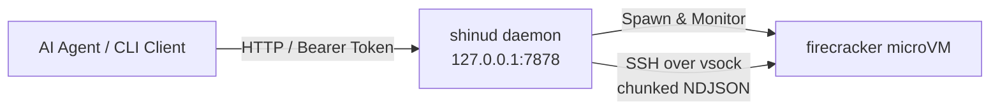

# Repository Guidelines

## Project Overview

`shinu` is a sandbox service designed for AI agents, offering Firecracker microVM execution with git-like version control and copy-on-write disk image branching.

A **space** is a named microVM instance tied to an ext4 disk image cloned via CoW (`cp --reflink=always`) from a base rootfs image (`<root>/base.ext4`).
`shinu` provides git-like disk versioning: spaces track commit DAGs, support cold/hot commits, history log chains, head checkouts (with auto-commit reflogs), and commit forks.

Clients interact with `shinud` solely over HTTP/1.1 using Bearer token authentication.
The daemon proxies execution (`exec`) via SSH over `vsock`, streaming output as chunked NDJSON, so client processes need no direct access to host filesystem paths or special group memberships (such as `kvm`).

## Architecture & Data Flow



- **Control Plane & Protocol** — `shinud` is a blocking HTTP/1.1 daemon listening by default on `127.0.0.1:7878`.
  Request routing is handled in `src/bin/shinud.rs:161-233`.
  The wire format for standard REST actions is JSON. The `exec` action streams NDJSON chunks via `Transfer-Encoding: chunked`, ending with an explicit exit status line `{"exit": N}` (`src/bin/shinud.rs:1044-1065`).
  Adding an operation requires touching:
  1. `proto::Req` in `src/lib.rs:3090`
  2. CLI `Command` enum in `src/bin/shinu.rs:26`
  3. HTTP route dispatcher in `src/bin/shinud.rs:161`
  4. `handle()` handler in `src/bin/shinud.rs:235`
- **Identity & Project Tenant Isolation** — Authentication uses `Authorization: Bearer <token>`.
  Tokens map to a **project** name (`src/lib.rs:288` `token` module).
  Tokens are stored in `<root>/tokens.json` (mode `0600`) as SHA-256 hashes (`src/lib.rs:359`) and compared in constant time (`src/lib.rs:363`).
  Project isolation is strict: spaces and commits belong to a project. Cross-project lookups return `NotFound` (404) to avoid leaking existence.
  Token management is strictly local via `shinu token new|ls|rm` (requires root access to `<root>/tokens.json`).
- **Concurrency & Locking Discipline** — `shinud` uses thread-per-connection concurrency with `shinu::registry::Registry` (`src/lib.rs:245`).
  Locking follows a two-tier model:
  1. Per-space lock (`Arc<Mutex<()>>` via `Registry::space_lock`): serializes long-running VM operations (start, stop, commit, checkout) on a single space.
  2. Global state lock (`Registry::state_lock`): protects quick `State::load` -> modify -> `State::store` file updates (`src/bin/shinud.rs:110-120`).
  **Lock Order Invariant**: Always acquire the space lock FIRST, then the state lock SECOND. Never hold the state lock across long disk/VM/btrfs operations.
  Locks handle poisoning via `.unwrap_or_else(|e| e.into_inner())` to prevent thread panics from cascading.
  `exec` acquires the space lock briefly to verify or start the VM, then releases it before running SSH streaming to allow concurrent execution in the same space.
- **Git Disk Versioning Semantics** — Disk state is tracked in `<root>/state.json` (`src/lib.rs:181` `state` module).
  - `Space`: `{ id, name, project, parent, head }`
  - `Ckpt` (Commit): `{ id, space, project, parent, auto, note, created_at }`
  - Commits form a DAG via `parent`. `log_chain` (`src/lib.rs:2511`) traces parent links back to root with cycle detection.
  - `checkout` creates an automatic reflog commit (`auto: true`) before moving `head` (`src/bin/shinud.rs:567-581`).
  - `is_referenced` (`src/lib.rs:2532`) verifies whether a commit is referenced by any space's `parent`, `head`, or another commit's `parent`.
- **Exec Path** — `exec` is proxied by `shinud` using `std::process::Command` with `Stdio::piped()`.
  The daemon runs `ssh` with `ProxyCommand=<shinu-vsock> <vsock.sock> <port>`, streaming stdout and stderr to the HTTP client as NDJSON.
  `<root>/vm/` and `<root>/spaces/` are restricted to mode `0700` (root-only host filesystem access).
- **HTTP Engine** — Hand-rolled HTTP parser and responder in `src/lib.rs:2693` (`http` module).
  Limits: Request line + headers max 64 KiB, max 100 headers, `Content-Length` max 1 MiB.
  `http::status_for` (`src/lib.rs:2961`) is the **single authoritative mapping** from domain `crate::Error` variants to HTTP status codes.

## Key Directories

| Path | Purpose |
|---|---|
| `src/lib.rs` | Core library: inline modules `btrfs` (58), `state` (181), `registry` (245), `token` (288), `vm` (1472), `http` (2693), `proto` (3084). |
| `src/bin/shinu.rs` | HTTP client CLI: clap CLI parsing, REST client dispatch, NDJSON stream parsing, local token management. |
| `src/bin/shinud.rs` | HTTP daemon: route parsing, authentication, connection handlers, VM lifecycle orchestrator. |
| `src/bin/shinu-vsock.rs` | Stdio-to-vsock proxy bridge used by SSH `ProxyCommand`. |
| `packaging/` | `install.sh` and `sv/shinud/run` (runit service definition). |

Runtime layout (`src/lib.rs:515` `init_layout` — explicit file modes, independent of umask):

```
<root>/tokens.json                 0600    hashed Bearer tokens
<root>/state.json                  0600    state database (spaces & commits)
<root>/base.ext4                   0644    golden base disk image
<root>/spaces/                     0700    dir; space CoW disk images (<id>.ext4)
<root>/ckpts/                      0700    dir; immutable commit disk images (<id>.ext4)
<root>/vm/<uuid>/                  0700    dir; VM runtime assets: fc.json, fc.sock,
                                           vsock.sock, fc.pid, id_ed25519, last_used
<root>/assets/                     0755    firecracker binary + vmlinux kernel
<root>/cache/                      0755    downloaded rootfs tarballs
```

## Development Commands

```sh
cargo build                          # debug build
cargo build --release                # release build expected by packaging/install.sh
cargo test                           # run unit test suite (45 passed)
cargo clippy --all-targets           # check for lint issues (currently 0 warnings)
cargo fmt --check                    # check formatting (has existing diffs)
```

Running the daemon and interacting via CLI / HTTP API:

```sh
# Start daemon (must run as root for KVM / mount / net / chown operations)
sudo ./target/release/shinud --root /tmp/shinu-dev

# Generate an authentication token for a project (local root command, does not use HTTP)
sudo ./target/release/shinu token new --project demo

# Set environment variables for client
export SHINU_ENDPOINT="http://127.0.0.1:7878"
export SHINU_TOKEN="<token-from-shinu-token-new>"

# CLI commands
shinu new web                        # create space
shinu exec web -- uname -a           # execute command over HTTP chunked stream
shinu commit web --note "v1"         # create cold commit (space must be stopped)
shinu commit web --note "hot" --hot  # create hot commit while running
shinu log web                        # show commit history DAG
shinu checkout web <commit-uuid>     # checkout commit (creates auto-commit reflog)
shinu fork <commit-uuid> web-branch  # fork commit into a new space
shinu stop web                       # stop microVM
shinu rm web                         # delete space
shinu rmckpt <commit-uuid>           # delete commit (refused if referenced)
shinu gc --free-below 10737418240    # run garbage collection
```

HTTP API usage via `curl`:

```sh
# List spaces and commits
curl -sH "Authorization: Bearer $SHINU_TOKEN" http://127.0.0.1:7878/v1/spaces

# Create a space
curl -sX POST -H "Authorization: Bearer $SHINU_TOKEN" \
  -H "Content-Type: application/json" \
  -d '{"name":"api-space"}' \
  http://127.0.0.1:7878/v1/spaces

# Stream exec execution
curl -sX POST -H "Authorization: Bearer $SHINU_TOKEN" \
  -H "Content-Type: application/json" \
  -d '{"cmd":["echo","hello"]}' \
  http://127.0.0.1:7878/v1/spaces/api-space/exec
```

CLI Subcommand Surface (`src/bin/shinu.rs:26`):
- `new <name>`
- `ls [--json]`
- `rm <space>`
- `start <space>`
- `stop <space>`
- `exec <space> -- <cmd...>`
- `commit <space> --note <note> [--hot]`
- `log <space> [--json]`
- `checkout <space> <commit-uuid>`
- `fork <commit-uuid> <name>`
- `rmckpt <commit-uuid>`
- `gc --free-below <bytes> [--dry-run]`
- `token new --project <project> | ls | rm <hash-prefix>`

## Code Conventions & Common Patterns

- **Synchronous std only.** Uses `std::process::Command`, `std::os::unix::net`, `std::thread`, `std::sync::Mutex`. No Tokio, async runtimes, or `log` crate. Errors print to `stderr` via `eprintln!`.
- **No `libc` dependency.** System attributes and commands use `/proc` reads or standard tools (`chown`, `df`, `btrfs`, `ip`, `iptables`, `sha256sum`).
- **Domain Errors** — Defined in `shinu::Error` (`src/lib.rs:20`): `Btrfs(String)`, `NotFound(String)`, `Invalid(String)`, `Auth(String)`, `Io(std::io::Error)`, `Json(serde_json::Error)`.
- **External Command Failures** — Standardized via `command_failure` (`src/lib.rs:1515`) to capture argv and stderr.
- **Environment-based Configuration** — All settings use `SHINU_*` env vars. No configuration files:
  - `SHINU_ROOT`: Root state directory (default `/var/lib/shinu`).
  - `SHINU_LISTEN`: HTTP daemon bind address (default `127.0.0.1:7878`).
  - `SHINU_REFLOG_DAYS`: Reflog auto-commit retention in days (default `7`).
  - `SHINU_VCPUS`: VM vCPU count (default `2`).
  - `SHINU_MEM_MIB`: VM memory limit in MiB (default `1024`).
  - `SHINU_IDLE_SECS`: Idle timeout before VM shutdown (default `600`).
  - `SHINU_DISK_MIB`: Base disk size in MiB, read on base build (default `2048`).
  - `SHINU_NET_ENABLE`: Enable TAP networking (default `true`).
  - `SHINU_NET_BASE`: IPv4 subnet base (default `172.31`).
  - Client side: `SHINU_ENDPOINT`, `SHINU_TOKEN`.
- **Concurrency & Lock Order Discipline** —
  1. Space lock first, state lock second. Never lock state then space.
  2. State lock scope must be minimal: load state, apply mutation, store state, release lock. Do NOT hold state lock during btrfs disk operations, subprocess spawning, or network calls.
- **Claim-before-Delete Pattern (GC & Mutation Discipline)** —
  When modifying shared state and deleting disk files (e.g. during `gc` or commit deletion), atomically claim the record under state lock first (re-verify conditions and remove entry from `State`), release state lock, and then delete files on disk. Deleting files before claiming under lock introduces race conditions with parallel requests.
- **Self-documenting Comments** — Comments explain *why*, not *what*. Doc comments on `pub` items document invariants and requirements.

## Important Files

- `src/lib.rs:6-17` — Core constants: `DEFAULT_ROOT`, `FC_VERSION` (`v1.13.1`), `KERNEL_URL` (vmlinux 6.1.141 with built-in virtio-blk/vsock/ext4), `VSOCK_SSH_PORT = 2222`.
- `src/lib.rs:465` `resolve_root` — Path resolution precedence: explicit `--root` > `$SHINU_ROOT` > `/var/lib/shinu`.
- `src/lib.rs:2345` `shell_quote` — Security-critical SSH shell argument quoting.
- `src/lib.rs:2961` `http::status_for` — Sole mapping of `Error` enum variants to HTTP status codes (Auth->401, NotFound->404, Invalid->400, Btrfs/Io/Json->500).
- `packaging/install.sh` — Copies binaries to `$PREFIX/bin` (`/usr/local/bin`) and service file to `$SVDIR/shinud` (`/etc/sv`). Note: `packaging/sv/shinud/run` hardcodes `/usr/local/bin/shinud`; if changing `PREFIX`, update `sv/shinud/run` as well.
- `Cargo.toml` — Rust edition 2024. Dependencies: `serde`, `serde_json`, `clap` (derive), `uuid` (v4), `chrono`.

## Testing & QA

- Total test count: **45 passed tests** across 4 modules/files:
  - `src/lib.rs`: 25 unit tests (`btrfs::tests`: 2, `token::token_tests`: 5, `base_tests`: 2, `sums_tests`: 2, `network_tests`: 4, `quote_tests`: 3, `chain_tests`: 4, `http::http_tests`: 3).
  - `src/bin/shinu.rs`: 3 unit tests (HTTP status parsing, NDJSON dispatching, token prefix matching).
  - `src/bin/shinud.rs`: 17 integration handlers/dispatch tests (hermetic dispatch tests with mock roots).
- **Test Execution Environment**:
  - Tests run via built-in `cargo test`.
  - Tests are hermetic: they run against temporary directories created via `std::env::temp_dir()`, use `NetConfig { enabled: false, .. }`, do not spawn real Firecracker VMs, do not perform btrfs reflink operations, and do not require root privileges.
  - `http_tests` test HTTP parsing using `std::io::Cursor` without opening network sockets.
- **Uncovered Paths (Require Manual Host Verification)**:
  - Real Firecracker microVM boot & shutdown.
  - Actual btrfs image reflink cloning (`cp --reflink=always`).
  - Linux TAP interface creation and iptables NAT setup.
  - Virtio-balloon memory reclamation.
  - Manual verification requires a Linux host with `/dev/kvm` and btrfs mount point.
- **Formatting Note**: `cargo fmt --check` has pre-existing diffs in `src/lib.rs`. Keep edits formatted but do not execute repo-wide reformatting.

## Invariants Worth Guarding

1. **Project Tenant Isolation Never Leaks Existence** — Lookups filter strictly by token project name and return `NotFound` (404). A space or commit belonging to another project is indistinguishable from a nonexistent entity.
2. **Tokens are Stored as Hashes & Compared in Constant Time** — Token plaintexts are never persisted; `<root>/tokens.json` stores SHA-256 hashes. Token validation uses `constant_time_eq` to prevent timing side-channel attacks.
3. **Strict Two-Tier Lock Order** — Space lock first, state lock second. State lock hold time MUST be minimal; never wrap long disk CoW or VM lifecycle calls inside the state lock.
4. **Atomically Claim Before Disk File Deletion** — State updates and record removals during deletions/GC must be completed inside the state lock before unlinking files from disk to prevent dangling references or race conditions.
5. **Reflink or Fail** — Space and commit creation must use `cp --reflink=always`. Never fall back to plain file copy on non-CoW filesystems.
6. **Reflog Preserves Explicit Commits** — Automatic cleanup (`gc`) or checkout reflogs must never auto-delete explicit user commits (`auto: false`).
7. **DAG Integrity via Multi-Edge Check** — `is_referenced` MUST check `space.parent`, `space.head`, and every commit's `ckpt.parent`. Deleting a commit with child dependencies breaks history chains.
8. **Binary Placement** — `shinu-vsock` MUST reside in the same directory as `shinu` (`current_exe()` resolution in `vsock_helper`).
