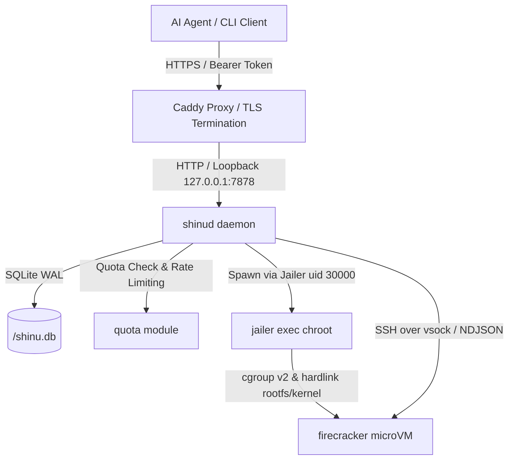

# Repository Guidelines

## Project Overview

`shinu` is a multi-tenant sandbox platform designed for AI agents, offering Firecracker microVM execution with git-like version control, copy-on-write (CoW) disk image branching, per-tenant quotas, and usage metering.

A **space** is a named microVM instance tied to an ext4 disk image cloned via CoW (`cp --reflink=always`) from a base rootfs image (`<root>/base.ext4`).
`shinu` provides git-like disk versioning: spaces track commit DAGs, support cold/hot commits, history log chains, head checkouts (with auto-commit reflogs), and commit forks.

Clients interact with `shinud` strictly over HTTP/1.1 using Bearer token authentication.
TLS is terminated externally (e.g., via Caddy), while the daemon listens on loopback.
The daemon proxies execution (`exec`) via SSH over `vsock`, streaming output as chunked NDJSON, so client processes need no direct access to host filesystem paths or special group memberships (such as `kvm`).
MicroVM processes are jailed inside unprivileged user/cgroup chroot sandboxes managed via Firecracker's Jailer.

## Architecture & Data Flow



- **Control Plane & Protocol** — `shinud` is a blocking HTTP/1.1 daemon listening by default on `127.0.0.1:7878`.
  Request routing is handled in `src/bin/shinud.rs:268-360`.
  The wire format for standard REST actions is JSON. The `exec` action streams NDJSON chunks via `Transfer-Encoding: chunked`, ending with an explicit exit status line `{"exit": N}` (`src/bin/shinud.rs:1186-1215`).
  Adding an operation requires touching:
  1. `proto::Req` in `src/lib.rs:4261`
  2. CLI `Command` enum in `src/bin/shinu.rs:26`
  3. HTTP route dispatcher in `src/bin/shinud.rs:268`
  4. `handle()` handler in `src/bin/shinud.rs:362`
  5. Quota check points (`quota::check_space_limit` / `check_disk_limit` / `check_running_limit`) in `src/bin/shinud.rs:188-202`
  6. Usage event logging (`state::record_usage`) in `src/bin/shinud.rs`
- **Identity & Project Tenant Isolation** — Authentication uses `Authorization: Bearer <token>`.
  Tokens map to a **project** name (`src/lib.rs:848` `token` module).
  Tokens are stored in `<root>/tokens.json` (mode `0600`) as SHA-256 hashes (`src/lib.rs:920`) and compared in constant time (`src/lib.rs:924`).
  Project isolation is strict: spaces, commits, quotas, and usage records belong to a project. Cross-project lookups return `NotFound` (404) to avoid leaking existence.
  Token management is strictly local via `shinu token new|ls|rm` (requires root access to `<root>/tokens.json`).
- **Jailer Sandbox Isolation** — `vm::start` (`src/lib.rs:2383`) launches Firecracker microVMs inside jailer chroot sandboxes (`/usr/bin/jailer`).
  Process属主 drops to unprivileged `shinu-jail` user/group (`SHINU_JAIL_UID` / `SHINU_JAIL_GID`, default 30000).
  cgroup v2 resource limits are enforced on each sandbox (`memory.max=1GiB`, `pids.max=512`).
  Kernel (`assets/vmlinux`) and rootfs images are hardlinked into the chroot tree at `<root>/jail/firecracker/<uuid>/root/` (zero-copy 2 GiB hardlink).
  Guest runtime assets (sockets, config, PID file) reside entirely inside the jail root directory; host side `<root>/vm/<uuid>/` retains only `last_used` and SSH keypairs.
- **Quotas & Throttling** — Resource ceilings and request throttling are enforced per project (`src/lib.rs:1025` `quota` module).
  Limits default to 5 spaces, 10240 MiB disk, 2 running VMs, and 120 API requests/min (`SHINU_LIMIT_*` env overrides, per-project overrides stored in `projects` table).
  Throttling uses a 60-second sliding window with automatic expired entry pruning.
  Exceeding quota or rate limits yields HTTP **429 Too Many Requests** (`Error::Quota`).
- **State Storage & Indexing** — SQLite in WAL mode (`<root>/shinu.db`, mode `0600`) replaces legacy JSON storage (`src/lib.rs:183` `state` module).
  Tables: `spaces`, `ckpts`, `projects`, `usage_events`, indexed on `(project, name)`, `ckpts.project`, `ckpts.space`, and `usage_events(project, at)`.
  Automatic one-time migration imports `state.json` into SQLite and renames it to `state.json.migrated` (`src/lib.rs:364`).
  Single-row indexed SQL queries are wired for mutation points (`commit_space`, `checkout_space`, `remove_space`, `remove_checkpoint`), while full-state snapshots are reserved for whole-DAG operations (`Ls`, `gc`, `Log`, `Reflog`, `is_referenced`).
- **Usage Metering** — Metering events are captured in the `usage_events` table.
  A 30-second background idle sweep thread records `vm_seconds` and `disk_mib_hour` metrics.
  API calls log `api_call` events; space creation and forks log `space_created`.
  Usage summaries and limit status are accessible via `GET /v1/usage` and `GET /v1/limits`.
- **Concurrency & Locking Discipline** — `shinud` uses thread-per-connection concurrency with `shinu::registry::Registry` (`src/lib.rs:805`).
  Locking follows a multi-tier model:
  1. Per-space lock (`Arc<Mutex<()>>` via `Registry::space_lock`): serializes long-running VM operations (start, stop, commit, checkout) on a single space.
  2. Global state lock (`Registry::state_lock`): serializes SQLite transactions and state modifications.
  3. Database connection lock (`Mutex<Connection>`): serializes SQLite access.
  **Lock Order Invariant**: Always acquire space lock FIRST, then state lock SECOND. Never hold locks across long disk CoW or network/VM execution operations.
  `exec` acquires space lock briefly to verify or boot the VM, releasing it before starting SSH streaming to permit concurrent executions in the same space.

## Key Directories

| Path | Purpose |
|---|---|
| `src/lib.rs` | Core library: inline modules `btrfs` (60), `state` (183), `registry` (805), `token` (848), `quota` (1025), `vm` (2362), `http` (3862), `proto` (4255). |
| `src/bin/shinu.rs` | HTTP client CLI: clap CLI parsing, REST client dispatch, NDJSON stream parsing, local token management. |
| `src/bin/shinud.rs` | HTTP daemon: route parsing, authentication, quota check, usage metering, connection handlers, VM lifecycle orchestrator. |
| `src/bin/shinu-vsock.rs` | Stdio-to-vsock proxy bridge used by SSH `ProxyCommand`. |
| `packaging/` | `install.sh`, `caddy/Caddyfile` (TLS termination config), and `sv/shinud/run` (runit service definition). |

Runtime layout (`src/lib.rs:1367` `init_layout` — explicit file modes, independent of umask):

```
<root>/tokens.json                 0600    hashed Bearer tokens
<root>/shinu.db                    0600    SQLite database (spaces, ckpts, projects, usage_events)
<root>/state.json.migrated         0600    backup of migrated state JSON (if migrated)
<root>/base.ext4                   0644    golden base disk image
<root>/spaces/                     0700    dir; space CoW disk images (<id>.ext4)
<root>/ckpts/                      0700    dir; immutable commit disk images (<id>.ext4)
<root>/vm/<uuid>/                  0700    dir; VM host-side assets: last_used, id_ed25519
<root>/jail/firecracker/<uuid>/    0700    dir; jailer chroot root: root/ (fc.json, fc.sock, vsock.sock, firecracker.pid, hardlinked kernel/disk)
<root>/assets/                     0755    firecracker binary + vmlinux kernel
<root>/cache/                      0755    downloaded rootfs tarballs
```

## Development Commands

```sh
cargo build                          # debug build
cargo build --release                # release build expected by packaging/install.sh
cargo test                           # run unit test suite (75 passed)
cargo clippy --all-targets           # check for lint issues (currently 0 warnings)
cargo fmt --check                    # check formatting (has existing diffs)
```

Host requirements for running `shinud`:
- Root privileges (for mount, net, TAP, chown operations).
- Linux host with `/dev/kvm` and a btrfs mount point for CoW reflink support.
- Dedicated unprivileged user/group `shinu-jail` (uid=30000, gid=30000).
- Linux cgroup v2 unified hierarchy mounted at `/sys/fs/cgroup`.

Running the daemon and interacting via CLI / HTTP API:

```sh
# Start daemon
sudo ./target/release/shinud --root /tmp/shinu-dev

# Generate an authentication token for a project (local root command, does not use HTTP)
sudo ./target/release/shinu token new --project demo

# Set environment variables for client
export SHINU_ENDPOINT="http://127.0.0.1:7878"
export SHINU_TOKEN="<token-from-shinu-token-new>"

# CLI commands
shinu new web                        # create space
shinu exec web -- uname -a           # execute command over HTTP chunked stream
shinu commit web --note "v1"         # create cold commit (space must be stopped)
shinu commit web --note "hot" --hot  # create hot commit while running
shinu log web                        # show commit history DAG
shinu reflog web                     # show full reflog history
shinu checkout web <commit-uuid>     # checkout commit (creates auto-commit reflog)
shinu fork <commit-uuid> web-branch  # fork commit into a new space
shinu stop web                       # stop microVM
shinu rm web                         # delete space
shinu rmckpt <commit-uuid>           # delete commit (refused if referenced)
shinu gc --free-below 10737418240    # run garbage collection
shinu usage                          # show project resource usage summary
shinu limits                         # show project resource quota limits
```

HTTP API usage via `curl`:

```sh
# Query project quota limits
curl -sH "Authorization: Bearer $SHINU_TOKEN" http://127.0.0.1:7878/v1/limits

# Query project usage metrics
curl -sH "Authorization: Bearer $SHINU_TOKEN" http://127.0.0.1:7878/v1/usage

# Create a space
curl -sX POST -H "Authorization: Bearer $SHINU_TOKEN" \
  -H "Content-Type: application/json" \
  -d '{"name":"api-space"}' \
  http://127.0.0.1:7878/v1/spaces

# Stream exec execution
curl -sX POST -H "Authorization: Bearer $SHINU_TOKEN" \
  -H "Content-Type: application/json" \
  -d '{"cmd":["echo","hello"]}' \
  http://127.0.0.1:7878/v1/spaces/api-space/exec
```

CLI Subcommand Surface (`src/bin/shinu.rs:26`):
- `new <name>`
- `ls [--json]`
- `rm <space>`
- `start <space>`
- `stop <space>`
- `exec <space> -- <cmd...>`
- `commit <space> --note <note> [--hot]`
- `log <space> [--json]`
- `reflog <space> [--json]`
- `checkout <space> <commit-uuid>`
- `fork <commit-uuid> <name>`
- `rmckpt <commit-uuid>`
- `gc --free-below <bytes> [--dry-run]`
- `usage [--from <timestamp>] [--to <timestamp>] [--json]`
- `limits [--json]`
- `token new --project <project> | ls | rm <hash-prefix>`

## Code Conventions & Common Patterns

- **Quota Check Before Mutation Inside State Lock** — Space and disk quota calculations (`quota::check_space_limit` / `check_disk_limit`) MUST be evaluated atomically inside `update_state_with_quota` before applying database writes. Performing quota checks outside the state lock allows concurrent requests to race past tenant ceilings.
- **Strict Separation of Disk Measurement Metrics** —
  - Quota capacity enforcement uses `btrfs::exclusive` to calculate **instantaneous physical disk usage**.
  - Usage billing tracking uses `disk_mib_hour` in `usage_events` as a **cumulative time series**.
  Do NOT use billing time-series totals for quota capacity checks; doing so causes long-running tenants with small disk footprints to be incorrectly rejected after accumulating historical hours.
- **Indexed Single-Row Queries vs. Full State Snapshots** —
  - Single-item lookups and mutation paths (`commit_space`, `checkout_space`, `remove_space`, `remove_checkpoint`) use direct SQL single-row queries via indexed fields (`project`, `name`, `id`).
  - Full DAG operations (`Ls`, `gc`, `Log`, `Reflog`, `is_referenced`) use `state::load` to fetch a full `State` snapshot.
  - Do NOT split `update_state` closure lookups into separate read transactions before lock acquisition, as this introduces TOCTOU (time-of-check to time-of-use) races.
- **Synchronous std only.** Uses `std::process::Command`, `std::os::unix::net`, `std::thread`, `std::sync::Mutex`. No Tokio, async runtimes, or `log` crate. Errors print to `stderr` via `eprintln!`.
- **No `libc` dependency.** System attributes and commands use `/proc` reads, `/sys/fs/cgroup` reads, or standard tools (`chown`, `df`, `btrfs`, `ip`, `iptables`, `sha256sum`, `jailer`).
- **Domain Errors** — Defined in `shinu::Error` (`src/lib.rs:20`): `Btrfs(String)`, `NotFound(String)`, `Invalid(String)`, `Auth(String)`, `Quota(String)`, `Io(std::io::Error)`, `Json(serde_json::Error)`.
- **External Command Failures** — Standardized via `command_failure` (`src/lib.rs:1515`) to capture argv and stderr.
- **Environment-based Configuration** — All settings use `SHINU_*` env vars. No configuration files:
  - `SHINU_ROOT`: Root state directory (default `/var/lib/shinu`).
  - `SHINU_LISTEN`: HTTP daemon bind address (default `127.0.0.1:7878`).
  - `SHINU_REFLOG_DAYS`: Reflog auto-commit retention in days (default `7`).
  - `SHINU_VCPUS`: VM vCPU count (default `2`).
  - `SHINU_MEM_MIB`: VM memory limit in MiB (default `1024`).
  - `SHINU_IDLE_SECS`: Idle timeout before VM shutdown (default `600`).
  - `SHINU_DISK_MIB`: Base disk size in MiB, read on base build (default `2048`).
  - `SHINU_JAIL_UID`: Unprivileged jailer UID (default `30000`).
  - `SHINU_JAIL_GID`: Unprivileged jailer GID (default `30000`).
  - `SHINU_LIMIT_SPACES`: Max spaces per project (default `5`).
  - `SHINU_LIMIT_DISK_MIB`: Max disk MiB per project (default `10240`).
  - `SHINU_LIMIT_RUNNING`: Max running VMs per project (default `2`).
  - `SHINU_LIMIT_API_PER_MIN`: Max API requests per minute per project (default `120`).
  - `SHINU_NET_ENABLE`: Enable TAP networking (default `true`).
  - `SHINU_NET_BASE`: IPv4 subnet base (default `172.31`).
  - Client side: `SHINU_ENDPOINT`, `SHINU_TOKEN`.
- **Concurrency & Lock Order Discipline** —
  1. Space lock first, state lock second. Never lock state then space.
  2. Lock hold scope must be minimal. Do NOT hold state or database locks during btrfs disk operations, subprocess spawning, or network calls.
- **Claim-before-Delete Pattern (GC & Mutation Discipline)** —
  When modifying shared state and deleting disk files (e.g. during `gc` or commit deletion), atomically claim the record under state lock first (re-verify conditions and remove entry from database), release lock, and then delete files on disk.

## Important Files

- `src/lib.rs:275` `state::open` — Opens `shinu.db` SQLite connection with WAL mode and foreign key constraints.
- `src/lib.rs:364` `state::migrate_from_json` — Imports legacy `state.json` into SQLite database and renames original file to `state.json.migrated`.
- `src/lib.rs:1025` `quota` — Resource limits (`Limits`), rate limiter (`RateLimiter`), and quota check functions.
- `src/lib.rs:2371` `vm::jail_root` / `vm::jail_socket` — Jailer chroot path calculations (`<root>/jail/firecracker/<uuid>/root`).
- `src/lib.rs:3862` `http` — Hand-rolled HTTP parser, NDJSON chunk writer, and error status mapper.
- `src/lib.rs:4130` `http::status_for` — Sole mapping of `Error` enum variants to HTTP status codes (Auth->401, NotFound->404, Invalid->400, Quota->429, Btrfs/Io/Json->500).
- `packaging/caddy/Caddyfile` — Reverse proxy and TLS termination configuration. Configures `flush_interval -1` to stream NDJSON without buffering and `read_timeout 0` for long-running `exec` commands.
- `packaging/install.sh` — Copies binaries to `$PREFIX/bin` (`/usr/local/bin`) and service file to `$SVDIR/shinud`. Creates `shinu-jail` user/group (uid/gid 30000). Note: `packaging/sv/shinud/run` hardcodes `/usr/local/bin/shinud`.
- `Cargo.toml` — Rust edition 2024. Dependencies: `serde`, `serde_json`, `clap` (derive), `uuid` (v4), `chrono`, `rusqlite 0.32` (`bundled`).

## Runtime / Tooling Preferences

- **Single Addition Dependency** — `rusqlite 0.32` with `bundled` feature is the sole added dependency (brings total direct dependencies from 5 to 6, total locked crates from 64 to 78). The `bundled` feature compiles SQLite directly into the crate, ensuring hermetic builds without relying on system `libsqlite3`.
- **Jailer Privileges & cgroup v2** — MicroVM isolation requires Firecracker's Jailer (`/usr/bin/jailer`), running under unprivileged UID/GID 30000 (`shinu-jail`) with cgroup v2 limits (`memory.max`, `pids.max`).
- **External TLS Termination** — `shinud` does not implement native TLS. TLS MUST be terminated by an upstream reverse proxy such as Caddy (`packaging/caddy/Caddyfile`), with `flush_interval -1` set to prevent buffering chunked NDJSON execution streams.

## Testing & QA

- Total test count: **75 passed tests** across modules and binaries:
  - `src/lib.rs`: 55 unit tests
    - `btrfs::tests`: 2
    - `state::db_tests`: 10
    - `token::token_tests`: 5
    - `quota::quota_tests`: 7
    - `base_tests`: 2
    - `sums_tests`: 2
    - `network_tests`: 4
    - `vm::jail_tests`: 5
    - `quote_tests`: 3
    - `chain_tests`: 6
    - `http::http_tests`: 9
  - `src/bin/shinu.rs`: 3 unit tests
  - `src/bin/shinud.rs`: 17 integration handler & dispatch tests
- **Test Execution Environment**:
  - Tests run via built-in `cargo test`.
  - Tests are hermetic: they run against temporary directories created via `std::env::temp_dir()`, use `NetConfig { enabled: false, .. }`, do not spawn real Firecracker VMs or Jailer sandboxes, do not perform btrfs reflink operations, and do not require root privileges.
- **Uncovered Paths (Require Manual Host Verification)**:
  - Execution via real Jailer `/usr/bin/jailer` chroot sandboxes.
  - Verification of cgroup v2 limits (`memory.max=1GiB`, `pids.max=512`).
  - Hardlink creation for kernel and rootfs into jail chroots (verifying identical inode and zero-copy 2 GiB link).
  - Real Firecracker microVM boot, execution, and shutdown.
  - Actual btrfs image reflink cloning (`cp --reflink=always`).
  - Linux TAP interface creation and iptables NAT setup.
  - Manual smoke testing requires a Linux host with `/dev/kvm`, btrfs mount point, cgroup v2 enabled, and unprivileged user `shinu-jail` (uid=30000).
- **Formatting Note**: `cargo fmt --check` has pre-existing diffs in `src/lib.rs`. Keep edits formatted but do not execute repo-wide reformatting.

## Invariants Worth Guarding

1. **Jailer Sandbox Isolation is Non-Negotiable** — `vm::start` MUST execute microVMs through Firecracker's Jailer under an unprivileged UID/GID (default 30000). Direct `firecracker` execution on the host is prohibited.
2. **Kernel and Rootfs Zero-Copy Hardlinking** — Assets linked into jail chroots (`<root>/jail/firecracker/<uuid>/root/`) MUST use hardlinks (`std::fs::hard_link`). Never fall back to copy operations, which consume 2 GiB per VM instance.
3. **Atomic Quota Check Inside State Lock** — Space and disk usage checks MUST be executed inside `update_state_with_quota` under the global state lock prior to performing database writes.
4. **Instantaneous vs. Cumulative Disk Measurement** — Disk quota capacity enforcement MUST use `btrfs::exclusive` instantaneous calculations. Billing time-series totals (`disk_mib_hour`) MUST NEVER be used for quota checks.
5. **Project Tenant Isolation Never Leaks Existence** — Lookups filter strictly by token project name and return `NotFound` (404). A space or commit belonging to another project is indistinguishable from a nonexistent entity.
6. **Tokens are Stored as Hashes & Compared in Constant Time** — Token plaintexts are never persisted; `<root>/tokens.json` stores SHA-256 hashes. Token validation uses `constant_time_eq` to prevent timing side-channel attacks.
7. **Strict Multi-Tier Lock Order** — Space lock first, state lock second. Lock hold time MUST be minimal; never wrap long disk CoW, VM execution, or network calls inside locks.
8. **Atomically Claim Before Disk File Deletion** — State updates and record removals during deletions/GC must be completed inside the state lock before unlinking files from disk to prevent dangling references or race conditions.
9. **Reflink or Fail** — Space and commit creation must use `cp --reflink=always`. Never fall back to plain file copy on non-CoW filesystems.
10. **Reflog Preserves Explicit Commits** — Automatic cleanup (`gc`) or checkout reflogs must never auto-delete explicit user commits (`auto: false`).
11. **DAG Integrity via Multi-Edge Check** — `is_referenced` MUST check `space.parent`, `space.head`, and every commit's `ckpt.parent`. Deleting a commit with child dependencies breaks history chains.
12. **State Migration Preserves User Data** — SQLite migration (`migrate_from_json`) MUST NOT delete `state.json`. It renames `state.json` to `state.json.migrated` after successful insertion.
13. **Binary Placement** — `shinu-vsock` MUST reside in the same directory as `shinu` (`current_exe()` resolution in `vsock_helper`).
